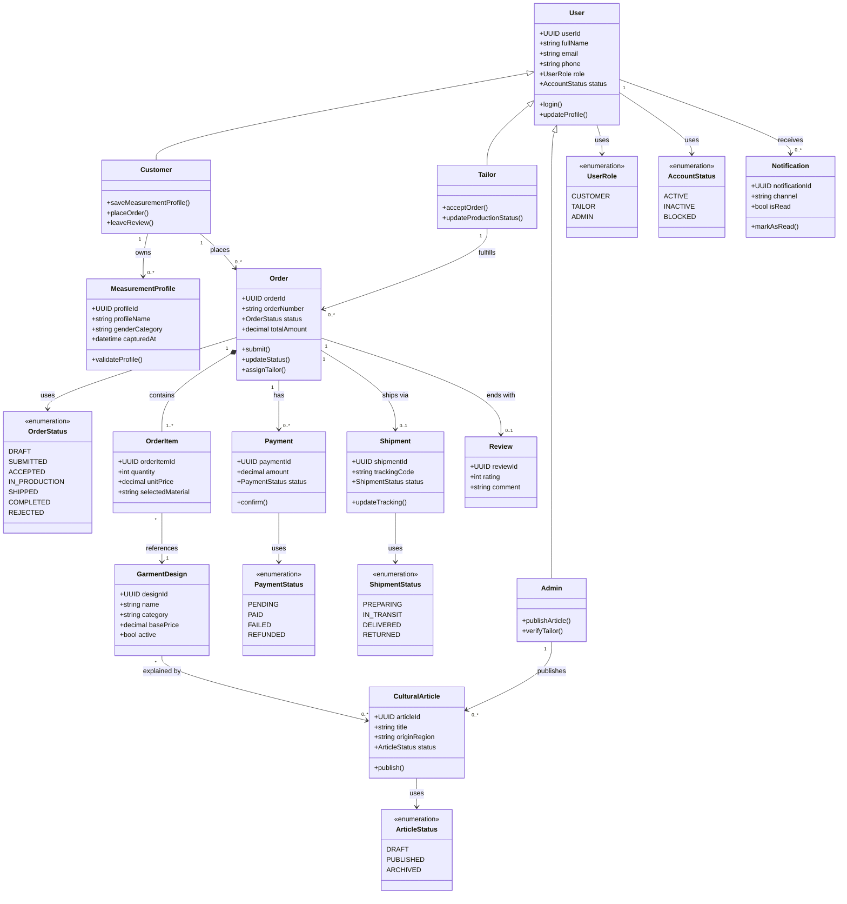

# Буриад хувцасны веб системийн Class Diagram

## 1. Зорилго

Энэ баримт дахь class diagram нь зөвхөн одоогийн frontend code-ийг биш, дипломын ажлын хүрээнд хөгжүүлэх бүрэн веб системийн домэйн моделиор хийгдсэн. Тиймээс хэрэглэгч, оёдолчин, хэмжээс, контент, захиалга, төлбөр, хүргэлт, зөвлөгөө, notification зэрэг бүх гол дэд системийг хамруулсан.

## 2. Хэрэглэх зөвлөмж

- `Компакт хувилбар` нь дипломын үндсэн бүлэгт оруулахад тохиромжтой.
- `Дэлгэрэнгүй хувилбар` нь хавсралт, техникийн тайлбар, database болон API загварын суурь болгоход тохиромжтой.
- Хэрэв хэвлэх үед диаграмм жижигдэж байвал үндсэн бичиг баримтад компакт хувилбарыг, хавсралтад дэлгэрэнгүй хувилбарыг ашиглах нь хамгийн зөв.

## 3. Компакт Class Diagram

Энэ хувилбар нь системийн хамгийн чухал entity болон хамаарлуудыг цэгцтэй харуулна.

## 4. Дэлгэрэнгүй Class Diagram

Энэ нь бүрэн систем хөгжүүлэхэд хэрэгтэй гол class-уудыг module түвшинд нь харуулсан илүү нарийн хувилбар юм.

```mermaid
classDiagram
  class User {
    +UUID userId
    +string fullName
    +string email
    +string phone
    +string passwordHash
    +UserRole role
    +AccountStatus status
    +datetime createdAt
    +datetime lastLoginAt
    +login()
    +logout()
    +updateProfile()
  }

  class Customer {
    +string preferredLanguage
    +saveMeasurementProfile()
    +startConsultation()
    +placeOrder()
    +leaveReview()
  }

  class Tailor {
    +string businessName
    +string specialization
    +decimal rating
    +bool verified
    +acceptOrder()
    +rejectOrder()
    +updateProductionStatus()
  }

  class Admin {
    +verifyTailor()
    +publishArticle()
    +archiveArticle()
    +resolveDispute()
  }

  class Address {
    +UUID addressId
    +string city
    +string district
    +string street
    +string detail
    +bool isDefault
  }

  class TailorPortfolio {
    +UUID portfolioId
    +string introduction
    +int minLeadDays
    +int maxLeadDays
    +bool acceptsCustomOrders
  }

  class MediaAsset {
    +UUID mediaId
    +string mediaType
    +string url
    +string caption
    +int sortOrder
  }

  class MeasurementGuide {
    +UUID guideId
    +string title
    +string targetGroup
    +GuideStatus status
    +publishGuide()
  }

  class MeasurementGuideStep {
    +UUID stepId
    +string bodyPart
    +string instructionText
    +string illustrationUrl
    +int stepOrder
  }

  class MeasurementProfile {
    +UUID profileId
    +string profileName
    +string genderCategory
    +datetime capturedAt
    +validateProfile()
    +cloneProfile()
  }

  class MeasurementValue {
    +UUID valueId
    +string metricCode
    +decimal metricValue
    +string unit
  }

  class MeasurementSnapshot {
    +UUID snapshotId
    +datetime frozenAt
    +string note
  }

  class SnapshotMeasurement {
    +UUID snapshotValueId
    +string metricCode
    +decimal metricValue
    +string unit
  }

  class GarmentCategory {
    +UUID categoryId
    +string name
    +string audience
    +string description
  }

  class GarmentDesign {
    +UUID designId
    +string name
    +string ceremonialUse
    +string silhouette
    +decimal basePrice
    +bool active
    +estimateBasePrice()
  }

  class MaterialOption {
    +UUID materialOptionId
    +string materialName
    +string color
    +decimal extraCost
    +bool available
  }

  class DesignSymbol {
    +UUID designSymbolId
    +string applicationArea
    +string colorMeaning
  }

  class CulturalArticle {
    +UUID articleId
    +string title
    +string slug
    +string originRegion
    +string era
    +string summary
    +ArticleStatus status
    +datetime publishedAt
    +publish()
    +archive()
  }

  class ArticleSection {
    +UUID sectionId
    +string heading
    +text bodyContent
    +int sectionOrder
  }

  class SymbolMeaning {
    +UUID symbolId
    +string symbolName
    +string interpretation
    +string placement
  }

  class ConsultationThread {
    +UUID threadId
    +ConsultationStatus status
    +datetime createdAt
    +closeThread()
  }

  class ConsultationMessage {
    +UUID messageId
    +string senderRole
    +text messageBody
    +string attachmentUrl
    +datetime sentAt
  }

  class Order {
    +UUID orderId
    +string orderNumber
    +OrderStatus status
    +decimal subtotal
    +decimal deliveryFee
    +decimal totalAmount
    +datetime createdAt
    +datetime expectedDeliveryAt
    +submit()
    +assignTailor()
    +calculateTotal()
    +updateStatus()
  }

  class OrderItem {
    +UUID orderItemId
    +int quantity
    +string selectedColor
    +string customNote
    +decimal unitPrice
    +calculateLineTotal()
  }

  class OrderStatusHistory {
    +UUID historyId
    +OrderStatus fromStatus
    +OrderStatus toStatus
    +string changedByRole
    +string note
    +datetime changedAt
  }

  class Payment {
    +UUID paymentId
    +decimal amount
    +string method
    +PaymentStatus status
    +string transactionReference
    +datetime paidAt
    +initiate()
    +verify()
    +refund()
  }

  class Shipment {
    +UUID shipmentId
    +string carrierName
    +string trackingCode
    +ShipmentStatus status
    +datetime shippedAt
    +datetime deliveredAt
    +createShipment()
    +updateTracking()
  }

  class Review {
    +UUID reviewId
    +int rating
    +string comment
    +bool approved
    +datetime createdAt
  }

  class Notification {
    +UUID notificationId
    +NotificationChannel channel
    +string title
    +string content
    +bool isRead
    +datetime sentAt
    +send()
    +markAsRead()
  }

  class UserRole {
    <<enumeration>>
    CUSTOMER
    TAILOR
    ADMIN
  }

  class AccountStatus {
    <<enumeration>>
    ACTIVE
    INACTIVE
    BLOCKED
  }

  class GuideStatus {
    <<enumeration>>
    DRAFT
    PUBLISHED
    ARCHIVED
  }

  class ArticleStatus {
    <<enumeration>>
    DRAFT
    PUBLISHED
    ARCHIVED
  }

  class ConsultationStatus {
    <<enumeration>>
    OPEN
    ANSWERED
    CONVERTED_TO_ORDER
    CLOSED
  }

  class OrderStatus {
    <<enumeration>>
    DRAFT
    SUBMITTED
    UNDER_REVIEW
    NEEDS_CLARIFICATION
    ACCEPTED
    REJECTED
    DEPOSIT_PAID
    IN_PRODUCTION
    READY
    SHIPPED
    DELIVERED
    COMPLETED
  }

  class PaymentStatus {
    <<enumeration>>
    PENDING
    PAID
    FAILED
    REFUNDED
  }

  class ShipmentStatus {
    <<enumeration>>
    PREPARING
    IN_TRANSIT
    DELIVERED
    RETURNED
  }

  class NotificationChannel {
    <<enumeration>>
    IN_APP
    EMAIL
    SMS
  }

  User <|-- Customer
  User <|-- Tailor
  User <|-- Admin

  User --> UserRole : uses
  User --> AccountStatus : uses
  MeasurementGuide --> GuideStatus : uses
  CulturalArticle --> ArticleStatus : uses
  ConsultationThread --> ConsultationStatus : uses
  Order --> OrderStatus : uses
  Payment --> PaymentStatus : uses
  Shipment --> ShipmentStatus : uses
  Notification --> NotificationChannel : uses

  Customer "1" --> "0..*" Address : owns
  Customer "1" --> "0..*" MeasurementProfile : saves
  Customer "1" --> "0..*" ConsultationThread : starts
  Customer "1" --> "0..*" Order : places

  Tailor "1" --> "1" TailorPortfolio : manages
  TailorPortfolio "1" *-- "0..*" MediaAsset : showcases
  Tailor "1" --> "0..*" ConsultationThread : answers
  Tailor "1" --> "0..*" Order : fulfills

  MeasurementGuide "1" *-- "1..*" MeasurementGuideStep : contains
  MeasurementProfile "1" *-- "1..*" MeasurementValue : includes
  MeasurementSnapshot "1" *-- "1..*" SnapshotMeasurement : freezes
  MeasurementGuideStep "1" --> "0..*" MeasurementValue : defines

  GarmentCategory "1" o-- "0..*" GarmentDesign : groups
  GarmentDesign "1" o-- "1..*" MaterialOption : offers
  GarmentDesign "1" o-- "0..*" DesignSymbol : uses
  DesignSymbol "*" --> "1" SymbolMeaning : references
  GarmentDesign "*" --> "0..*" CulturalArticle : documented in

  CulturalArticle "1" *-- "1..*" ArticleSection : consists of
  ArticleSection "1" o-- "0..*" MediaAsset : enriched by
  Admin "1" --> "0..*" CulturalArticle : publishes
  Admin "1" --> "0..*" MeasurementGuide : approves

  ConsultationThread "1" *-- "1..*" ConsultationMessage : contains
  ConsultationThread "0..1" --> "0..1" Order : converts to

  Order "1" *-- "1..*" OrderItem : contains
  Order "1" *-- "1" MeasurementSnapshot : uses
  Order "1" o-- "0..*" OrderStatusHistory : tracks
  Order "1" --> "1" Address : ships to
  Order "1" --> "0..*" Payment : has
  Order "1" --> "0..1" Shipment : ships via
  Order "1" --> "0..1" Review : ends with

  OrderItem "*" --> "1" GarmentDesign : for
  OrderItem "*" --> "1" MaterialOption : selected as

  Review "*" --> "1" Customer : written by
  Review "*" --> "1" Tailor : about

  User "1" --> "0..*" Notification : receives
  Notification "0..*" --> "0..1" Order : related to
```

## 5. Яагаад энэ class diagram сайн суурь болох вэ?

Энэ загвар нь дараах зүйлсийг нэг дор шийдэж өгч байна:

1. `Role-based system`
Хэрэглэгч, оёдолчин, админ гэсэн 3 үндсэн actor-ийг inheritance-ээр ялгасан.

2. `Reusable measurement model`
Хэмжээсийг profile хэлбэрээр хадгалж, order хийх үед snapshot болгон царцаадаг. Энэ нь захиалгын түүх өөрчлөгдөхөөс сэргийлнэ.

3. `Marketplace + cultural knowledge` хосолсон бүтэц
Захиалгын веб болон буриад хувцасны түүх, утга тайлбарын knowledge base-ийг нэг системд уялдуулсан.

4. `Real production workflow`
Consultation, order status history, payment, shipment, review бүгд орсон тул бодит амьдрал дээр ашиглаж болох системийн загвар болсон.

5. `Backend болон database руу хөрвүүлэхэд бэлэн`
Эндээс ERD, REST API, admin module, dashboard, order workflow-ийг шууд задлан боловсруулах боломжтой.

## 6. Дараагийн алхам

Энэ class diagram дээр тулгуурлаад дараагийн баримтуудыг гаргах нь хамгийн зөв:

1. `ERD`
Entity бүрийг хүснэгт болгон задлах.

2. `Use case specification`
Order, consultation, content publishing, tailor verification урсгалуудыг тус бүр тайлбарлах.

3. `API specification`
`/auth`, `/customers`, `/tailors`, `/measurements`, `/orders`, `/articles`, `/notifications`

4. `Page map / sitemap`
Хэрэглэгчийн харах хуудас болон admin dashboard-ийг тодорхойлох.
