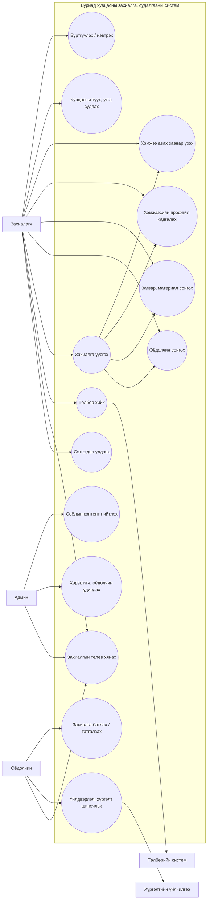
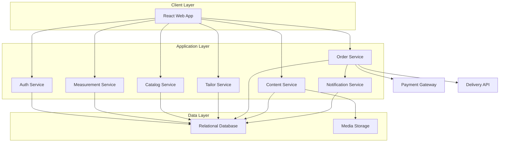
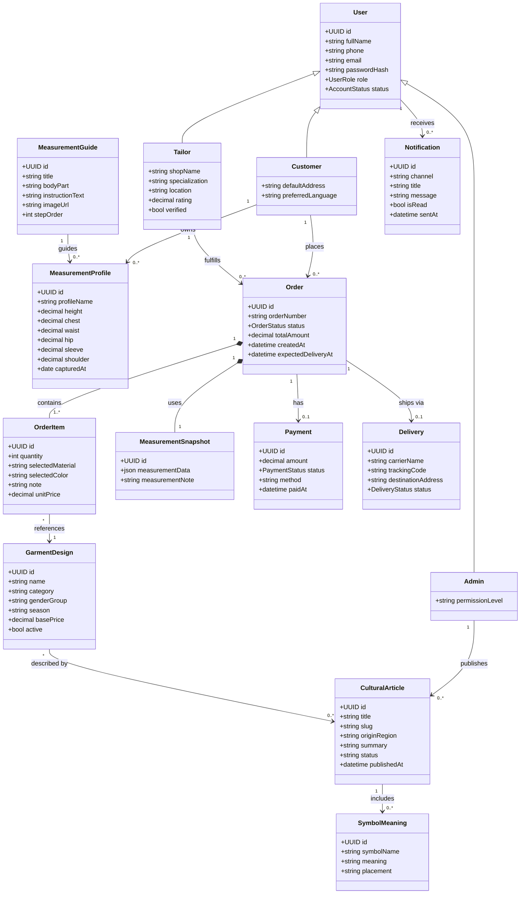
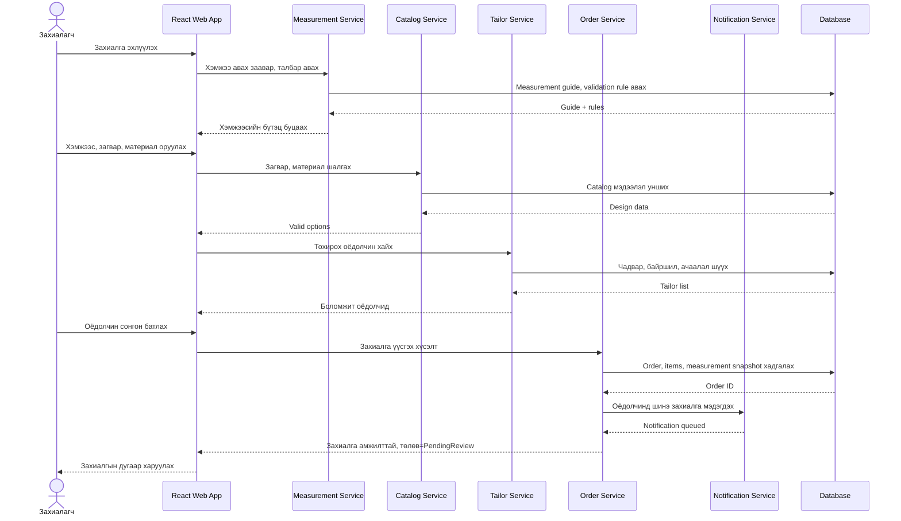
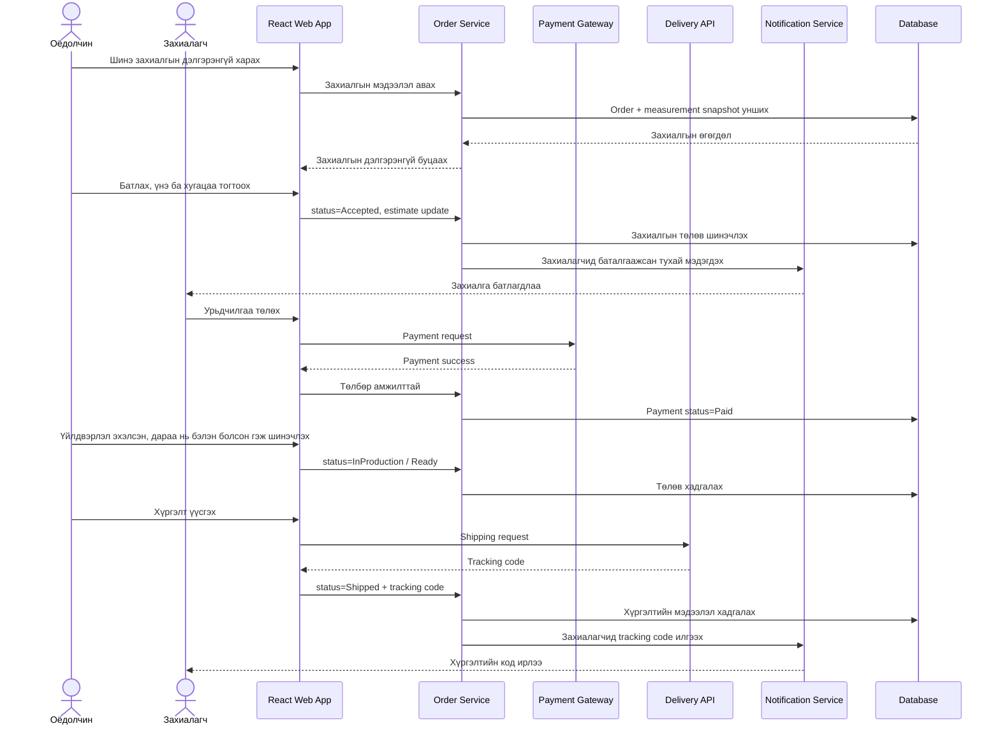
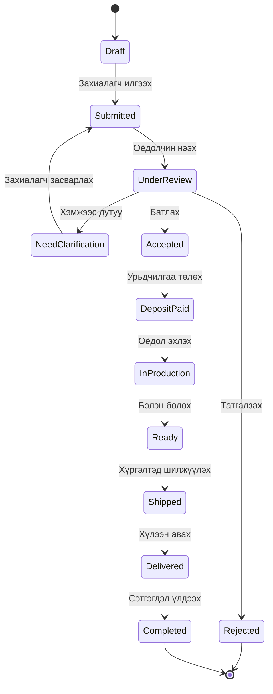

# Буриад хувцасны веб системийн шинжилгээ ба диаграмм

## 1. Төслийн одоогийн төлөв

Одоогийн repository нь `React + Vite + react-router-dom` дээр суурилсан эхний загвар байна. Нүүр хуудасны визуал чиглэл, навигаци, брендийн өнгө төрх, үндсэн route-ууд бэлэн болсон боловч системийн үндсэн бизнес логик хараахан хэрэгжээгүй байна.

Одоогийн байдлаар:

- Нүүр хуудас, танилцуулгын хэсгүүд бэлэн.
- `Захиалга өгөх`, `Хувцасны утга`, `Бидний тухай` хуудсууд placeholder төлөвтэй.
- Хэрэглэгчийн бүртгэл, нэвтрэлт, өгөгдлийн сан, API, оёдолчин удирдлага, хэмжээсийн форм, захиалгын төлөв, admin хэсэг одоогоор алга.

Иймээс доорх диаграммууд нь одоогийн кодыг тайлбарлах бус, дипломын ажлын зорилтот системийг зөв архитектуртайгаар төлөвлөхөд зориулагдсан.

## 2. Системийн зорилго

Энэхүү веб системийн зорилго нь:

- Монгол дахь буриад хэрэглэгчид болон оёдолчдыг онлайнаар холбох
- Биеийн хэмжээс авч, алдааг багасгасан захиалгын урсгал бий болгох
- Буриад хувцасны гарал, утга, бэлгэдэл, хэрэглээний тухай мэдлэгийн сан үүсгэх
- Уламжлалт хувцасны захиалга, үйлдвэрлэл, хүргэлтийн явцыг нэг системээр удирдах

## 3. Гол actor-ууд

1. `Захиалагч / Хэрэглэгч`
Хувцасны мэдээлэл үзэх, хэмжээс оруулах, захиалга өгөх, төлөв хянах үндсэн хэрэглэгч.

2. `Оёдолчин / Дархан`
Захиалга хүлээн авах, хэмжээс шалгах, үйлдвэрлэлийн явц шинэчлэх, хүргэлт рүү шилжүүлэх хэрэглэгч.

3. `Админ / Контент менежер`
Хувцасны түүх, утга, тайлбар контент нийтлэх, хэрэглэгч болон оёдолчдын мэдээлэл удирдах, маргаантай захиалга хянах үүрэгтэй.

4. `Гадаад системүүд`
Төлбөр, хүргэлт, мэдэгдлийн системүүд.

## 4. Гол модулиуд

- `Authentication & Profile`
- `Measurement Guide & Measurement Profile`
- `Garment Catalog`
- `Tailor Marketplace`
- `Order Management`
- `Payment & Delivery`
- `Cultural Knowledge Base`
- `Admin & Content Management`
- `Notification Center`

## 5. Use Case Diagram

Энэ диаграмм нь системийн оролцогчид болон тэдний хийж чадах үндсэн үйлдлүүдийг харуулна.

## 6. Component Diagram

Энэ нь системийг frontend, backend service, өгөгдлийн түвшинд хэрхэн хуваахыг харуулсан зорилтот архитектур юм.

## 7. Domain Class Diagram

Энэ диаграмм нь системийн үндсэн entity-үүд болон тэдгээрийн хамаарлыг тодорхойлно. Дараа нь database schema, API contract, backend model гаргахад энэ хэсэг маш хэрэгтэй.

Дэлгэрэнгүй, дипломын баримт бичигт зориулагдсан тусдаа class diagram-г [class-diagram.md](./class-diagram.md)-д бэлдсэн.

## 8. Sequence Diagram: Хэрэглэгч захиалга үүсгэх

Энэ нь хэмжээс оруулж, оёдолчин сонгон захиалга үүсгэх үндсэн бизнес урсгал юм.

## 9. Sequence Diagram: Оёдолчин захиалга боловсруулах

Энэ нь захиалга батлах, төлбөр, үйлдвэрлэл, хүргэлтийн шат дарааллыг харуулна.

## 10. State Diagram: Захиалгын төлөв

Энэ диаграмм нь `Order` entity-ийн lifecycle-ийг тодорхойлно.

## 11. Дипломын ажлын хувьд санал болгох шаардлагын бүтэц

Доорх бүлгүүдийг дипломын бичиг баримтад тусгавал систем илүү цэгцтэй харагдана.

1. `Оршил`
Судалгааны үндэслэл, асуудал, зорилго, зорилтууд.

2. `Одоогийн нөхцөл байдлын шинжилгээ`
Уламжлалт буриад хувцас захиалах хүндрэл, хэмжээсийн алдаа, мэдээллийн хомсдол.

3. `Системийн шаардлагын шинжилгээ`
Functional requirements, non-functional requirements, actor-ууд.

4. `Системийн зохиомж`
Use case, component, class, sequence, state diagram.

5. `Өгөгдлийн сангийн зохиомж`
ERD, хүснэгтүүд, primary/foreign key.

6. `Хэрэгжүүлэлт`
Frontend, backend, database, deployment.

7. `Туршилт ба үнэлгээ`
Form validation, order flow test, usability test, performance test.

## 12. Дараагийн санал болгож буй алхмууд

Диаграммын дараа дараах ажлуудыг хийхэд хамгийн зөв дараалал болно:

1. `Requirement specification` бичих
Use case бүрийн pre-condition, main flow, alternative flow, post-condition-ийг тодорхойлох.

2. `Database ERD` гаргах
Одоогийн class diagram-аас реляц бүтэц рүү хөрвүүлэх.

3. `Information architecture` тодорхойлох
Нүүр, захиалга, хэмжээсийн заавар, каталог, оёдолчин, контент, admin dashboard.

4. `Low-fidelity wireframe` зурах
Ялангуяа хэмжээсийн форм, захиалгын алхамчилсан wizard, контент хуудсууд.

5. `API contract` тодорхойлох
`/auth`, `/measurements`, `/orders`, `/tailors`, `/articles`, `/admin`.

---

Хэрэв хүсвэл дараагийн алхамд би энэ баримт дээр үндэслээд:

- `ERD` диаграмм
- `requirement specification`
- `user flow`
- `wireframe structure`
- эсвэл энэ системийн `page map / sitemap`

гэсэн дараагийн дипломын материалуудыг мөн шууд бэлдэж өгч чадна.
